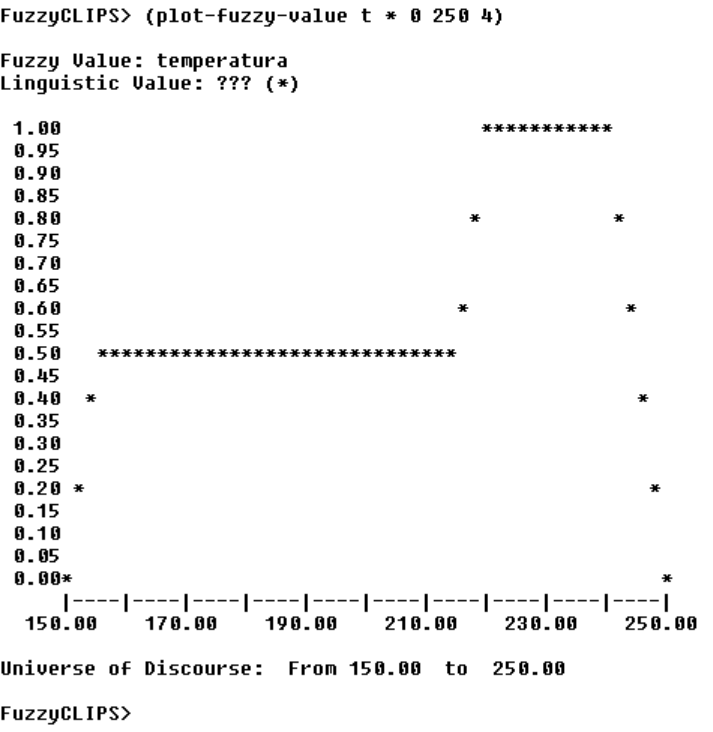

# Sistemas Expertos: Control Difuso de Horno (Galletas de la Abuela)

Este repositorio contiene la implementación de un sistema de control difuso (Fuzzy Logic) desarrollado en **CLIPS**. El objetivo del sistema es automatizar el control de temperatura de un horno basándose en el aspecto visual de las galletas, replicando el conocimiento experto de la "Abuela María".

## 📋 Descripción del Problema

El sistema experto ajusta la temperatura del horno basándose en reglas de inferencia difusa que relacionan el **Índice Cromático** de las galletas con la **Temperatura** ideal:

* **Entrada (Antecedente):** Estado de las galletas (Poco crudas, Medio hechas, Doraditas).
* **Salida (Consecuente):** Temperatura del horno (Baja, Media, Alta).

### Caso de Prueba
Para este ejercicio, se ha simulado una situación donde el índice cromático es **6**.
El sistema utiliza conjuntos difusos trapezoidales y triangulares para calcular la temperatura exacta mediante desfusificación (Centro de Masas y Máximo).

## 📂 Estructura del Proyecto

* `galletas_bc.clp`: **Base de Conocimientos**. Contiene la definición de los *templates* (variables lingüísticas) y las *reglas* de inferencia.
* `galletas_bh.clp`: **Base de Hechos**. Define el estado inicial del sistema (índice cromático = 6).
* `batch.clp`: **Script de Ejecución**. Archivo *batch* que carga el conocimiento, inicializa los hechos, ejecuta el motor de inferencia e imprime los resultados en consola.
* `image.png`: Gráfica del conjunto difuso resultante de la temperatura.
<div align="center">
  
  <p><em>Gráfico generado por FuzzyCLIPS</em></p>
</div>
## 🚀 Cómo ejecutar

Para correr este proyecto se requiere **FuzzyCLIPS**.

1.  Clona este repositorio o descarga los archivos.
2.  Abre la consola de FuzzyCLIPS.
3.  Sitúate en el directorio del proyecto y ejecuta el script:

```clips
(batch "batch.clp")
